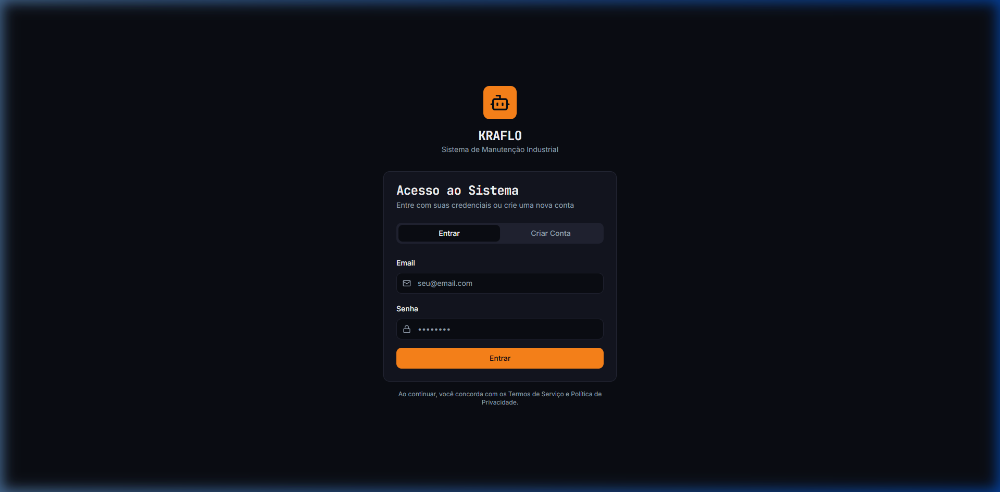
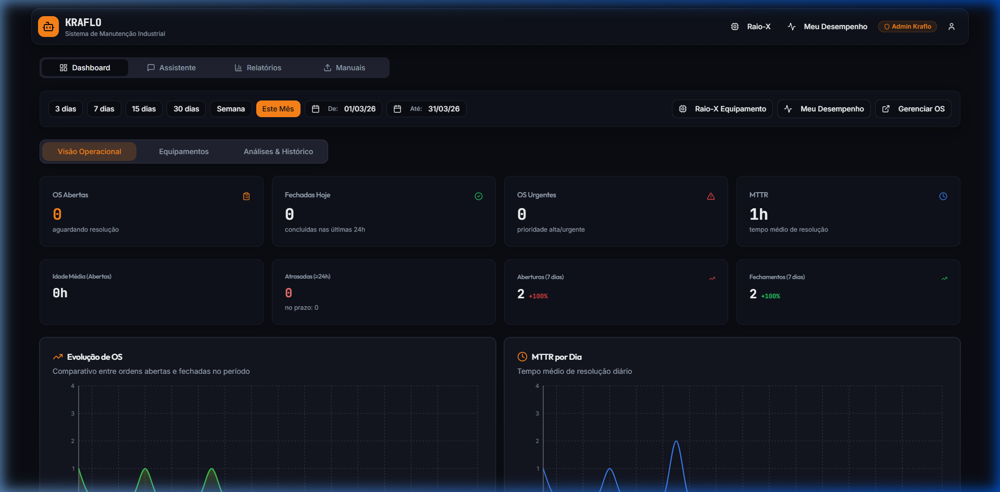
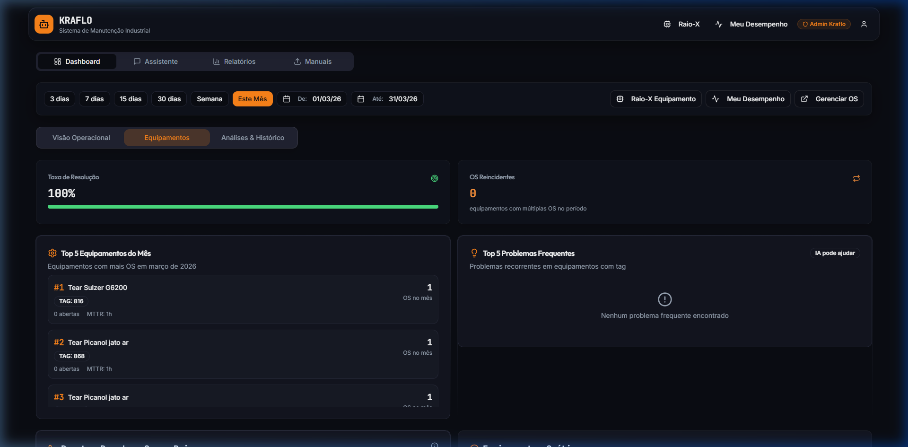
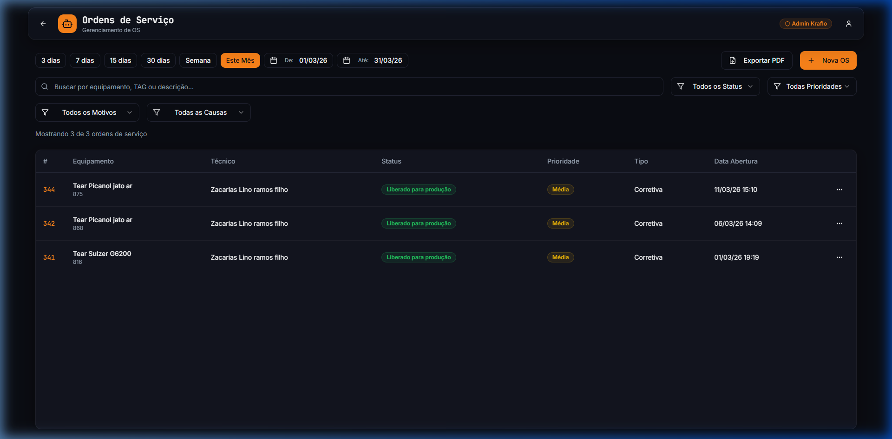
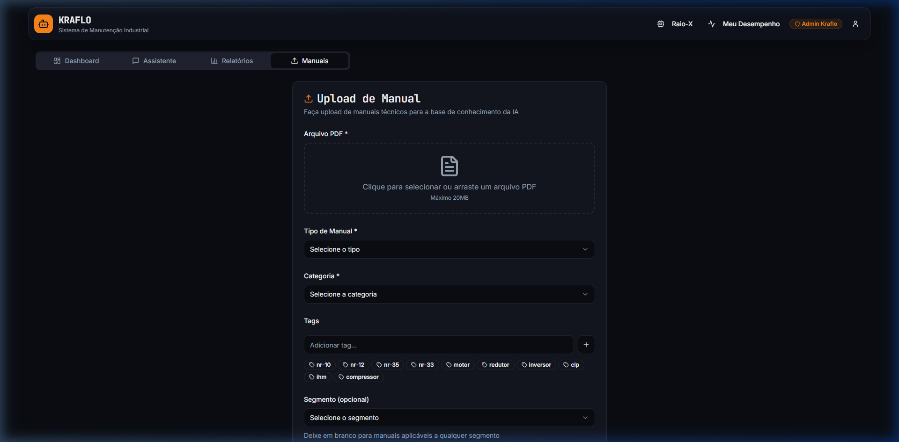

# 🚀 Kraflo CMMS

**Kraflo** is a modern, premium **Computerized Maintenance Management System (CMMS)** designed for high-performance industrial teams. 

Experience a "Deep Tech" environment with a glassmorphism aesthetic, providing a top-tier user experience while maintaining robust, enterprise-grade functionality for managing equipment, work orders (Ordens de Serviço), and technical teams.

---

## 📸 Interface Preview

### 🔐 Multi-Role Authentication
Secure and modern login experience with support for multiple user roles and granular access control.



### 📊 Operational Dashboard
A central "Command Bridge" for your maintenance operations. Track real-time metrics, MTTR, and OS distribution in a clean Bento-box layout.



### ⚙️ Equipment Insight
Deep dive into your equipment performance. Track top-performing machines and manage their specific maintenance history.



### 📋 Service Order Management
Complete control over work orders with a powerful, searchable table and real-time status tracking.



### 📚 Technical Knowledge Base (Biblioteca)
Centralize all technical manuals and procedures in a secure, easy-to-access library.



---

## 🌟 Key Features

- **Premium UI/UX:** Built with a "Floating Command Bridge" navigation and a "Bento Box" dashboard layout.
- **Advanced Dashboard:** Real-time metrics, operational summaries, and equipment tracking.
- **Work Order Management (OS):** Create, track, and manage maintenance tasks efficiently.
- **Knowledge Base (Biblioteca):** Centralized repository for manuals and procedures.
- **AI Assistant:** Integrated AI for technical assistance and industrial insights.
- **Role-Based Access Control:** Secure, granular permissions using Supabase RLS.

---

## 🛠️ Technology Stack

| Frontend | Backend & Infra |
| :--- | :--- |
| **React 18** (Vite) | **Supabase** (PostgreSQL) |
| **TypeScript** | **Edge Functions** (Deno) |
| **Tailwind CSS** (Premium Theme) | **Row Level Security (RLS)** |
| **shadcn/ui** (Radix UI) | **GitHub Actions** (CI/CD) |
| **TanStack Query** | **Postgres Triggers** |

---

## 🚀 Quick Start

### Prerequisites
- Node.js (v20+)
- Supabase Project

### Installation

1. **Clone & Install**
   ```sh
   git clone https://github.com/lino167/Kraflo-CMMS.git
   cd Kraflo-CMMS
   npm install
   ```

2. **Environment Setup**
   Create a `.env` file with:
   ```env
   VITE_SUPABASE_URL="your-project-url"
   VITE_SUPABASE_PUBLISHABLE_KEY="your-anon-key"
   ```

3. **Run Dev Server**
   ```sh
   npm run dev
   ```

---
*Built with ❤️ for the future of industrial maintenance.*
